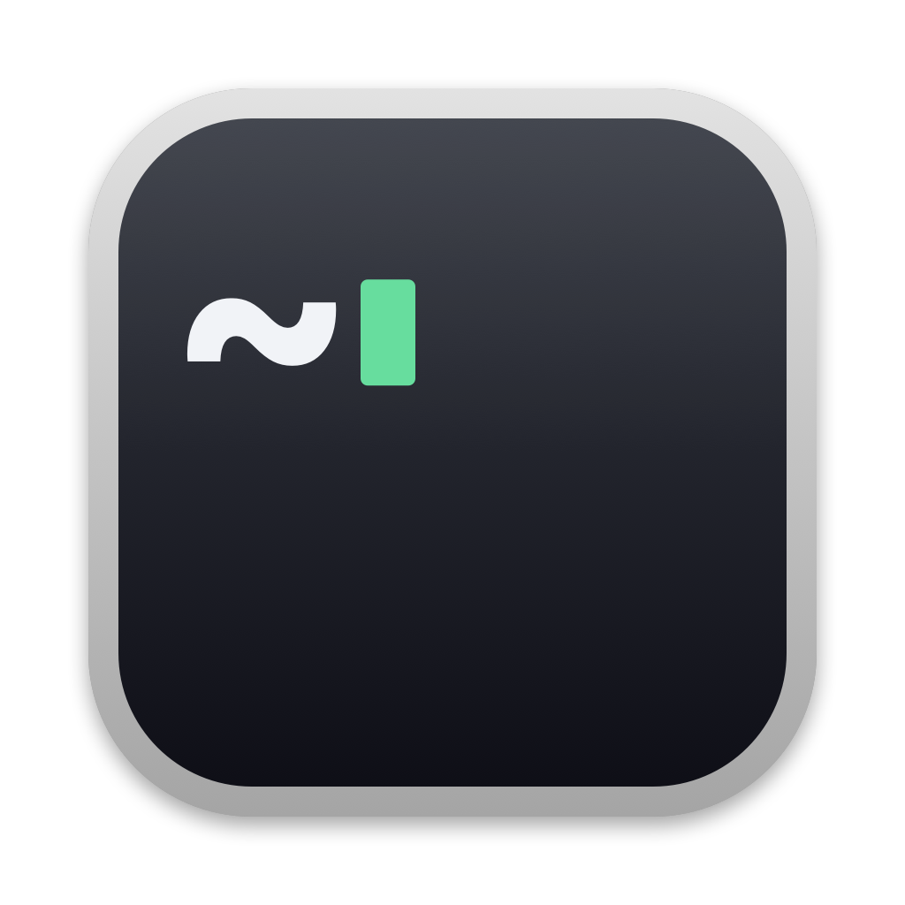
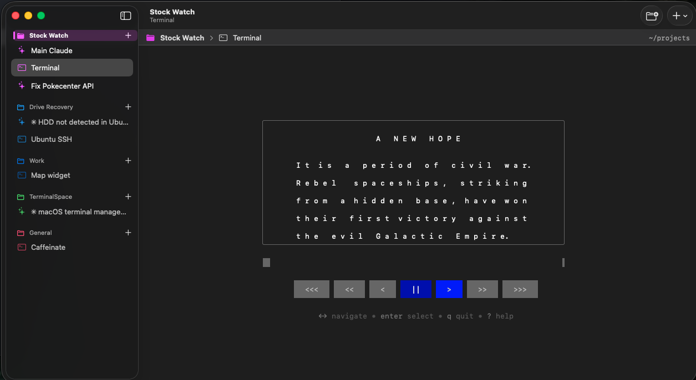

<p align="center">
  
</p>

# TerminalSpace

TerminalSpace is a native macOS terminal app that puts your terminals into workspaces.
Each workspace is a project folder. Each terminal in a workspace can be a normal shell,
a [Claude Code](https://claude.com/claude-code) session, an [opencode](https://opencode.ai) session,
or any command that you configure, for example `ssh`.

The app uses [SwiftTerm](https://github.com/migueldeicaza/SwiftTerm) for terminal emulation.



## Features

- **Workspaces:** A sidebar shows your workspaces. The terminals of each workspace show under it.
- **Launchers:** The new-terminal menu shows a list of launchers. Each launcher has a name, an icon, and a command. The default launchers are Terminal, Claude, and opencode. Add your own, for example `ssh user@host`. The command starts in the workspace folder. When it stops, the tab continues as a normal shell.
- **Run Command:** Start any command one time, or save it as a launcher.
- **Drag and drop:** Drag a terminal to a different workspace, or to a different position.
- **Restore:** When you quit, the app saves your terminals. At the next start:
  - A Terminal tab shows its last output and opens a shell in its last folder.
  - A tab from a custom launcher shows its last output. By default, it runs its command again.
  - A Claude tab resumes the same conversation, also after `/resume` or `/clear`.
  - An opencode tab continues the last session in the workspace folder.
- **Themes:** The themes follow the profiles of the macOS Terminal app: Basic, Pro, Homebrew, Ocean, Grass, Man Page, Novel, Red Sands, and Silver Aerogel. You can set a default theme and a different theme for each workspace.
- **Workspace colors:** Each workspace has a color in the sidebar. A workspace theme can also set this color.
- **Settings:** Font, font size, cursor shape, and cursor blink.

## Requirements

- macOS 14 or later
- Swift 6 toolchain (Xcode 16 or later, or the Command Line Tools)
- Optional: `claude` and `opencode` in your login shell `PATH`

## Build

```sh
git clone https://github.com/burghr/TerminalSpace.git
cd TerminalSpace
./build.sh
open build/TerminalSpace.app
```

`build.sh` builds a release binary and makes `build/TerminalSpace.app`. The app has an ad-hoc signature only.

Options:

- `./build.sh --run` stops the running copy, then opens the new build. The running copy saves its terminals before it stops.
- If the Xcode license is not accepted, `build.sh` uses the Command Line Tools.

To change the icon, edit `Scripts/make-icon.swift`, then run `swift Scripts/make-icon.swift`.

## Keyboard shortcuts

| Action | Shortcut |
|---|---|
| New workspace | Shift-Cmd-N |
| First launcher (Terminal) | Cmd-T |
| Second launcher (Claude) | Shift-Cmd-T |
| Third launcher (opencode) | Option-Cmd-T |
| Launchers 4 to 9 | Control-Cmd-4 to Control-Cmd-9 |
| Run Command | Shift-Cmd-R |
| Close terminal | Cmd-W |
| Settings | Cmd-, |

The launcher shortcuts follow the order of the launchers in Settings.

Right-click a workspace to rename it, or to set its color or theme. Right-click a terminal to rename or close it.

## Launchers

Open **Settings > Launchers** to add, edit, remove, or reorder launchers. Each launcher has these settings:

| Setting | Description |
|---|---|
| Name | The name in the menu, and the default name of new tabs |
| Icon | The icon in the menu and in the sidebar |
| Command | The command to run in your login shell. Leave it empty to start a normal shell. |
| Resume support | **None**, **Claude Code**, or **opencode**. See below. |

Resume support controls what happens when TerminalSpace restores a terminal:

- **None:** An option runs the command again. For example, an SSH launcher connects again.
- **Claude Code:** TerminalSpace adds `--settings` and a session ID to the command. You can add your own flags, for example `claude --model opus`.
- **opencode:** TerminalSpace adds `--continue` to the command.

A terminal keeps a copy of its launcher from when it started. A change to a launcher does not change terminals that are already open.

## How Claude sessions resume

A Claude conversation can change its ID, for example after `/resume` or `/clear`. To track the current ID, TerminalSpace starts Claude with `--settings`. That settings file adds a `SessionStart` hook. The hook writes the current session data to a file for each terminal. Your own Claude settings and hooks stay active.

## Data

TerminalSpace keeps its data in `~/Library/Application Support/TerminalSpace`:

| File | Content |
|---|---|
| `workspaces.json` | Workspaces: name, folder, color, theme |
| `sessions.json` | Open terminals and the selected terminal |
| `scrollback/` | Output of Terminal tabs, from the last quit. The app deletes it after a restore. |
| `claude-settings.json` | The hook settings for Claude |
| `claude-state/` | The current Claude session of each terminal |

The app keeps its settings and launchers in the `com.coconetlabs.terminalspace` defaults domain.

## Limits

- A running command stops when you quit. The terminal opens again, but you must start the command again.
- The restored output of a Terminal tab is plain text without colors.
- Two opencode terminals in the same folder continue the same session.

## License

MIT. See [LICENSE](LICENSE). SwiftTerm is also MIT licensed.
